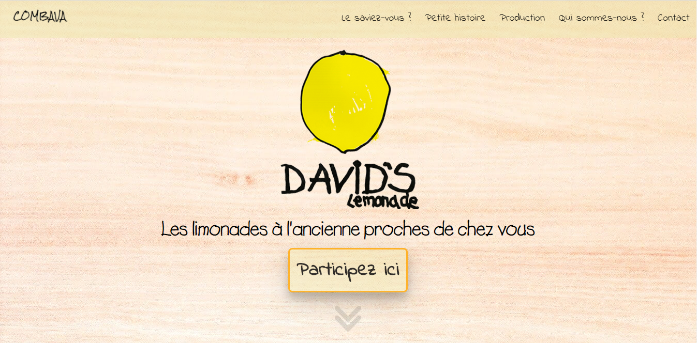

# David's Lemonade :lemon:

*Dans le cadre du module M2105 (Interface Homme-Machine), nous avons réalisé un landing page pour une association fictive appelée Combava, dans lequel le site doit leur permettre à promouvoir leurs prochains événements de dégustation de citronnade.*

### Date de réalisation (1 mois)
23 mars 2020 - 10 mai 2020

### Enseignants encadrants
- Marion GISSLER
- Necer FAYCAL

### Membres
- Anthony AUDOIN
-  Léo MERCIER
-  Marie TACONET 

### Langages
- HTML
- CSS
- UX/UI

Sujet/Enoncé/Source : https://www.cloudschool.org/iut-info  

